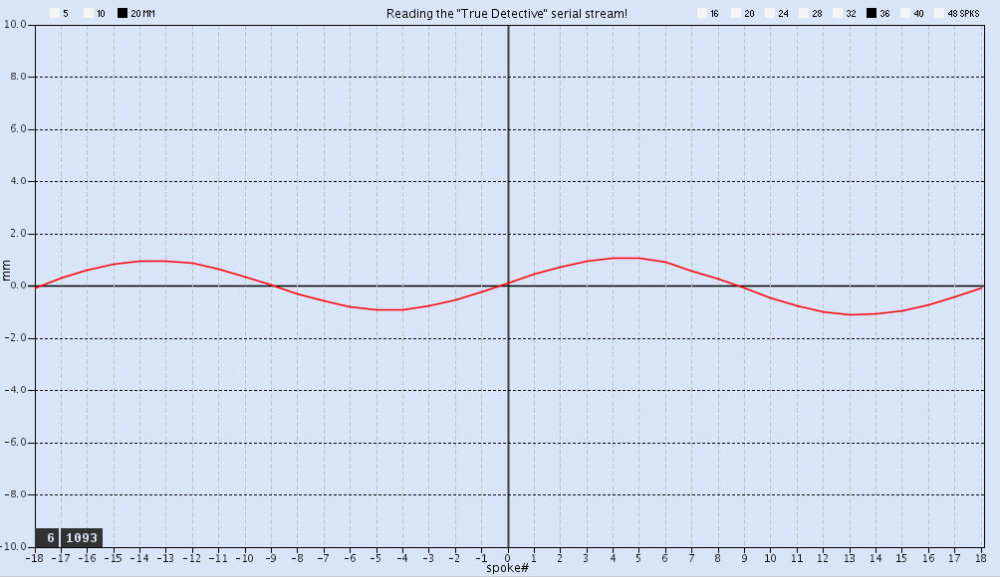
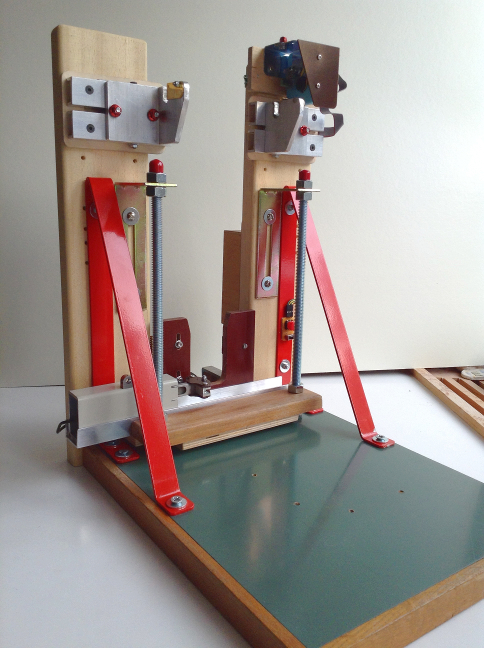

## True Detective 

A digital bicycle wheel truing system.

Here is the layout of the graphing chart. It is shown here in simulation mode, self-generating fake serial signals in the form of a slightly randomised sinusoidal curve, for testing purposes:

And here is the actual physical truing stand:

The µC which manages to process all the inputs from the three sensors (after some level-shifting) is an Arduino Mega 2560. It runs the ***True_Detective_DRO.ino*** sketch. This code is rather verbosely commented and should be self-explanatory. 

The software responsible for displaying the rim-curve ”live” is a Processing sketch (Java-code) titled ***Inspector_Rotam.pde*** which is run on a PC and receives the data stream serially from the µC by USB at 57600 baud. It then updates the chart's red line-graph, which connects the datapoints, with the measurements closest to each detected spoke along the rim. The graphical result is a horisontal red line, more or less undulating, depending on the rim's degree of (mis)alignment at that point. The centre-most spoke/datapoint in the chart represents the ”zero-spoke”, i.e. the spoke that the operator has set as a temporary zero-value reference point (”ticked”), by pushing the tick button.

See the project's decription page here for more details: http://xneb.org/mabe/xnebmisc/home/true-detective,html or https://sites.google.com/view/xneb-project-logs/home/true-detective

